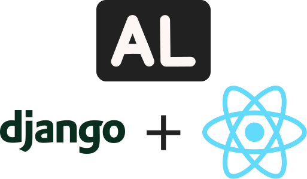

# Web-Application-Project - Alunno

<div align="center">
   
</div>

## What is Alunno?

Alunno is a web-based course management application for Web application programming course which uses [Django](https://www.djangoproject.com/) and [React](https://reactjs.org/) including beautiful design, feature-rich.

## Features

## Getting Started

### Prerequisites

- Python: [3.9.7](https://www.python.org/ftp/python/3.9.7/)
- Nodejs: [17.1.0](https://nodejs.org/dist/v17.1.0/)

### Setup

1. Get the source code

   ```
   git clone https://github.com/ducluongtran9121/Web-Application-Project.git
   cd Web-Application-Project
   ```

2. Set up

- Set up python environment

  - Create environment:

    ```
    cd backend
    python -m venv .env
    ```

  - Active environment:

    - Powershell:

      ```
      .env\Scripts\Activate.ps1
      ```

    - Command Prompt:

      ```
      .env\Scripts\activate.bat
      ```

    - UNix

      ```
      .env\Scripts\activate
      ```

  - Install dependencies:

    ```
    pip install -r .\requirement.txt
    ```

  - Migrate Django

    ```
    python manage.py makemigrations
    python manage.py migrate
    ```

- Set up frontend environment:

  - Install dependencies:

    ```
    cd frontend
    pnpm i
    ```

  - Add server api url environment variable: (You can use your backend url)

    ```
    echo "REACT_APP_API_URL=http://127.0.0.1:8000" > .env.local
    ```

### Run

- Backend:

  ```
  python manage.py runserver
  ```

- Frontend:

  - To run dev app:

    ```
    pnpm run dev
    ```

  - To build the app:

    ```
    pnpm run build
    ```

## Tech Stack

- [Python](https://www.python.org/)
- [TypeScript](https://www.typescriptlang.org/)
- [Django](https://www.djangoproject.com/)
- [Django REST](https://www.django-rest-framework.org/)
- [SQLite](https://www.sqlite.org/index.html)
- [React](https://reactjs.org/)
- [Chakra UI](https://chakra-ui.com/)
- [Vite](https://vitejs.dev/)

## Contributors

Thanks goes to these wonderful people ([emoji key](https://allcontributors.org/docs/en/emoji-key)):

<!-- ALL-CONTRIBUTORS-LIST:START - Do not remove or modify this section -->

<table>
  <tr>
    <td align="center"><a href="https://github.com/thihuynhdotexe"><br /><sub><b>thihuynhdotexe</b></sub></a><br /><a href="https://github.com/ducluongtran9121/Web-Application-Project/commits?author=thihuynhdotexe" title="Code">💻</a> <a href="#maintenance-thihuynhdotexe" title="Maintenance">🚧</a> <a href="#projectManagement-thihuynhdotexe" title="Project Management">📆</a></td>
    <td align="center"><a href="https://github.com/pinanek23"><br /><sub><b>Ngo Duc Hoang Son</b></sub></a><br /><a href="https://github.com/ducluongtran9121/Web-Application-Project/commits?author=pinanek23" title="Code">💻</a> <a href="https://github.com/ducluongtran9121/Web-Application-Project/commits?author=pinanek23" title="Documentation">📖</a> <a href="#design-pinanek23" title="Design">🎨</a> <a href="#maintenance-pinanek23" title="Maintenance">🚧</a></td>
    <td align="center"><a href="https://github.com/ducluongtran9121"><br /><sub><b>janlele91</b></sub></a><br /><a href="https://github.com/ducluongtran9121/Web-Application-Project/commits?author=ducluongtran9121" title="Code">💻</a> <a href="#maintenance-ducluongtran9121" title="Maintenance">🚧</a></td>
  </tr>
</table>

<!-- ALL-CONTRIBUTORS-LIST:END -->
